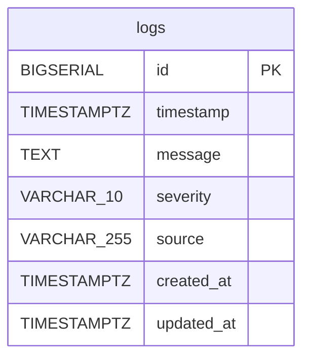

# ER図

> 要件定義: [`docs/requirements/requirements_specification.md § 4. DB設計`](../requirements/requirements_specification.md)

---

## テーブル一覧

本システムのスコープでは `logs` テーブル1つのみ。認証・ロール管理は実装スコープ外。

---

## ER図



---

## テーブル定義詳細

### logs

| カラム | 型 | 制約 | 説明 |
|--------|-----|------|------|
| `id` | `BIGSERIAL` | PK | サロゲートキー。自動採番 |
| `timestamp` | `TIMESTAMPTZ` | NOT NULL | ログ発生日時（タイムゾーン付き）。DBレベルの DEFAULT なし。省略時のデフォルト値は Service 層で設定する |
| `message` | `TEXT` | NOT NULL | ログメッセージ本文。空文字不可 |
| `severity` | `VARCHAR(10)` | NOT NULL, CHECK | `INFO` / `WARNING` / `ERROR` / `CRITICAL` のいずれか |
| `source` | `VARCHAR(255)` | NOT NULL | ログ発生源（サービス名・モジュール名など）。空文字不可 |
| `created_at` | `TIMESTAMPTZ` | NOT NULL, DEFAULT NOW() | レコード作成日時 |
| `updated_at` | `TIMESTAMPTZ` | NOT NULL, DEFAULT NOW() | レコード最終更新日時。SQLAlchemy `onupdate=func.now()` で自動更新 |

---

## インデックス

| インデックス名 | 対象カラム | 目的 |
|--------------|-----------|------|
| `ix_logs_timestamp` | `timestamp` | 日付範囲フィルタ・ソート |
| `ix_logs_severity` | `severity` | severity フィルタ・集計 |
| `ix_logs_source` | `source` | source フィルタ・集計 |

---

## 制約詳細

### CHECK 制約（severity）

```sql
CONSTRAINT logs_severity_check
  CHECK (severity IN ('INFO', 'WARNING', 'ERROR', 'CRITICAL'))
```

Pydantic スキーマ側でも `Literal['INFO', 'WARNING', 'ERROR', 'CRITICAL']` で二重バリデーションを行う。

---

## DDL（参考）

```sql
CREATE TABLE logs (
    id          BIGSERIAL     PRIMARY KEY,
    timestamp   TIMESTAMPTZ   NOT NULL,
    message     TEXT          NOT NULL,
    severity    VARCHAR(10)   NOT NULL
                  CONSTRAINT logs_severity_check
                  CHECK (severity IN ('INFO', 'WARNING', 'ERROR', 'CRITICAL')),
    source      VARCHAR(255)  NOT NULL,
    created_at  TIMESTAMPTZ   NOT NULL DEFAULT NOW(),
    updated_at  TIMESTAMPTZ   NOT NULL DEFAULT NOW()
);

CREATE INDEX ix_logs_timestamp ON logs (timestamp);
CREATE INDEX ix_logs_severity  ON logs (severity);
CREATE INDEX ix_logs_source    ON logs (source);
```

> **注意:** 実際のマイグレーションは Alembic の `--autogenerate` で管理する。このDDLは設計確認用の参考情報。
