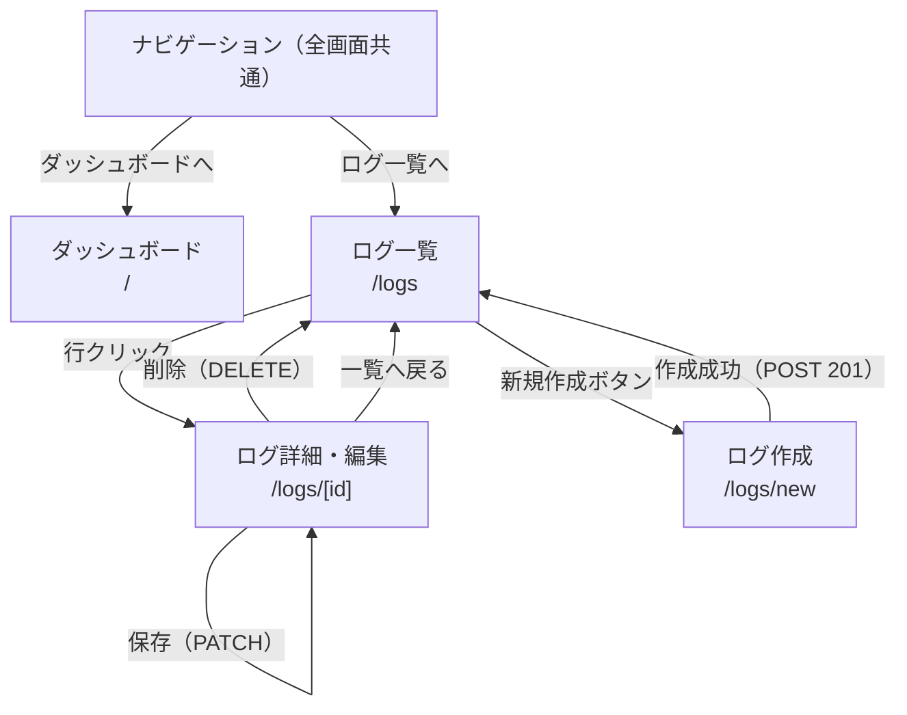

# 画面遷移図

> 要件定義: [`docs/requirements/requirements_specification.md`](../requirements/requirements_specification.md)

---

## 画面一覧

| 画面名 | パス | 概要 |
|--------|------|------|
| ダッシュボード | `/` | severity 別サマリー・時系列チャート・ヒストグラム |
| ログ一覧 | `/logs` | ログ一覧・フィルタ・ソート・ページネーション |
| ログ詳細 | `/logs/[id]` | ログ詳細表示・編集・削除 |
| ログ作成 | `/logs/new` | ログ新規作成フォーム |

---

## 画面遷移

---

## 画面別の詳細

### ダッシュボード（`/`）

| 要素 | 内容 |
|------|------|
| フィルタパネル | 日付範囲・severity（複数選択）・source（完全一致）でデータをフィルタ |
| severity サマリーカード | INFO / WARNING / ERROR / CRITICAL の件数を表示（`GET /logs/analytics/summary`） |
| 時系列チャート | 期間内のログ件数推移（interval: hour / day / week 切替）（`GET /logs/analytics/timeseries`） |
| ヒストグラム | source × severity の分布（`GET /logs/analytics/summary` の `histogram` フィールド） |

### ログ一覧（`/logs`）

| 要素 | 内容 |
|------|------|
| フィルタパネル | 日付範囲・severity（複数選択）・source（部分一致） |
| ログテーブル | id / timestamp / severity / source / message 列。列クリックでソート切替 |
| ページネーション | 1ページあたり件数選択（デフォルト 50）・ページ送り |
| CSV エクスポート | 現在のフィルタ条件で `GET /logs/export/csv` を呼び出す |
| 新規作成ボタン | `/logs/new` へ遷移 |

### ログ詳細（`/logs/[id]`）

| 要素 | 内容 |
|------|------|
| 一覧へ戻る | `/logs` へ遷移するリンク |
| 詳細表示 | 全フィールド（id / timestamp / severity / source / message / created_at / updated_at） |
| 編集フォーム | timestamp / severity / source / message をインライン編集。「保存」で `PATCH /logs/{id}` |
| 削除 | 「削除」ボタン → 確認ダイアログ → `DELETE /logs/{id}` → ログ一覧へリダイレクト |

### ログ作成（`/logs/new`）

| 要素 | 内容 |
|------|------|
| フォーム | timestamp（省略可）・severity（選択必須）・source（必須）・message（必須） |
| バリデーション | React Hook Form + Zod で入力チェック。エラーはフィールド下に表示 |
| 作成成功 | `POST /logs` → 201 → ログ一覧（`/logs`）へリダイレクト |
