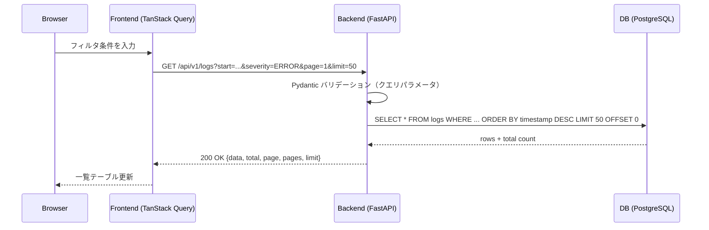
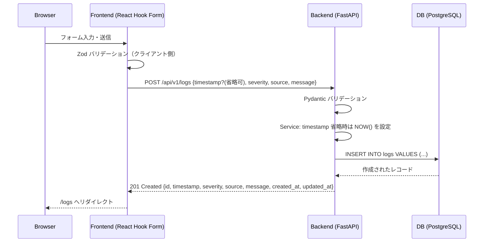
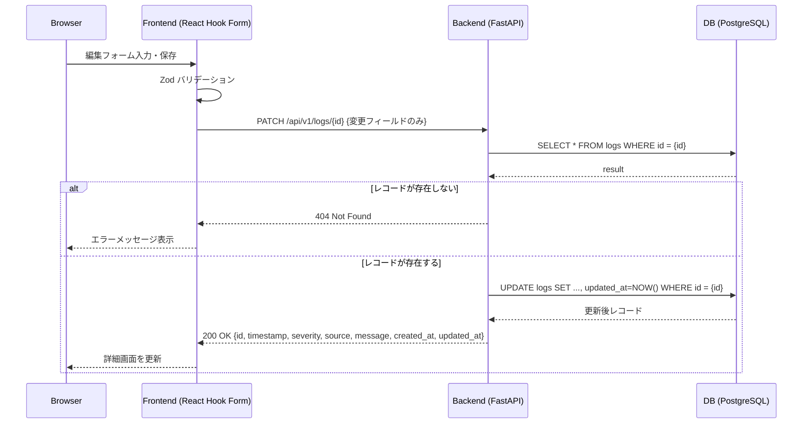
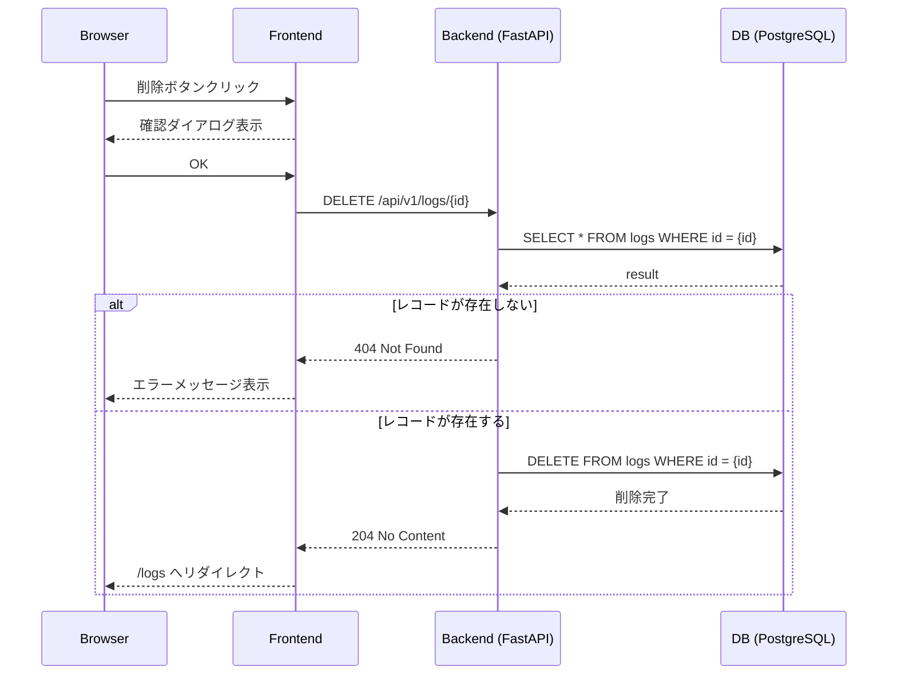
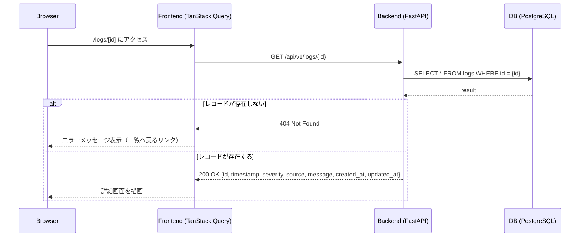
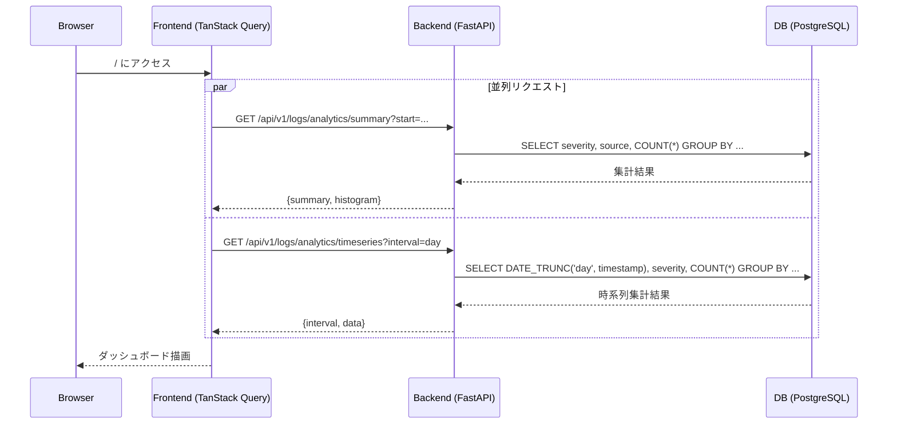

# シーケンス図

> 要件定義: [`docs/requirements/requirements_specification.md`](../requirements/requirements_specification.md)

主要ユースケースのフロントエンド〜API〜DB間の処理フローを定義する。

---

## UC-01: ログ一覧取得・フィルタ検索



---

## UC-02: ログ作成



---

## UC-03: ログ編集



---

## UC-04: ログ削除



---

## UC-05: ログ詳細取得



---

## UC-06: ダッシュボード表示



---

## UC-07: CSV エクスポート

```mermaid
sequenceDiagram
    participant B as Browser
    participant F as Frontend
    participant A as Backend (FastAPI)
    participant D as DB (PostgreSQL)

    B->>F: CSV エクスポートボタンクリック
    F->>A: GET /api/v1/logs/export/csv?start=...&severity=...&source=...
    A->>D: SELECT * FROM logs WHERE ... ORDER BY timestamp DESC
    D-->>A: rows
    A->>A: CSV 生成（UTF-8 BOM付き、カラム順: id, timestamp, severity, source, message）
    A-->>F: 200 OK Content-Disposition: attachment; filename="logs_YYYYMMDD.csv"
    F-->>B: ファイルダウンロード
```
